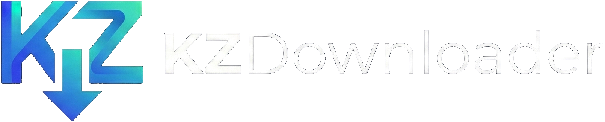

<div align="center">
&nbsp;
<p align="center">
  
  <br>
</p>

**A beautiful, cross-platform desktop download manager with AI-powered video analysis.**

[](https://flutter.dev)
[](https://dart.dev)
[](LICENSE)
[]()


[English](#english) &nbsp;•&nbsp; [Italiano](https://github.com/TopLeon/KZDownloader/blob/main/translations/README-it.md)

</div>

---

> [!WARNING]
> **KZDownloader is currently in beta.** You may encounter bugs or incomplete features. Please report any issues on the [issue tracker](../../issues).

<a id="english"></a>

## Overview

KZDownloader is a cross-platform desktop application built with Flutter that lets you download videos, music, and generic files from hundreds of websites. It integrates a powerful AI assistant that can summarize YouTube video content and answer questions about it. 

The design is modern, minimal, and fully reactive, featuring animated neon/rainbow gradient borders on download cards and interactive elements, smooth transitions, and real-time progress feedback.

## ✨ Features

### 🎬 Video & Audio Downloads
- Download videos and audio from **YouTube** and hundreds of other platforms powered by [yt-dlp](https://github.com/yt-dlp/yt-dlp).
- Choose **video format** (MP4, MKV) and **quality** before downloading, with two selector modes:
  - **Simple**: Best · High · Medium · Low
  - **Expert**: 2160p (4K) · 1440p · 1080p · 720p · 480p
- Download entire **YouTube playlists** with configurable concurrency — each video is tracked individually.
- Audio-only extraction to **MP3, M4A, OGG (Vorbis)**.

### 📁 Generic File Downloader
- Blazing fast, multi-threaded, **IDM-style chunked download** for any direct HTTP/HTTPS link.
  - **Writer Isolate**: a dedicated Dart isolate writes data directly to the final file position via `RandomAccessFile`, eliminating temporary files and redundant I/O passes.
  - **Backpressure control (ackIterator)**: each network worker waits for the Writer Isolate to acknowledge a successful disk write before fetching the next chunk — preventing Out-of-Memory crashes when network throughput exceeds disk write speed.
  - **Dynamic Connection Reuse**: once a connection finishes its assigned byte range it is immediately reassigned to the slowest active chunk, keeping the maximum number of connections busy at all times for sustained peak download speeds.
- Automatic **resume support** — interrupted downloads pick up where they left off if the server supports range requests.
- Per-chunk progress visualization with active worker count and individual segment progress bars.
- Built on a Rust-based HTTP backend ([rhttp_plus](https://pub.dev/packages/rhttp_plus)) for maximum throughput and **TLS fingerprinting** to avoid bot-detection on protected servers.

### 🤖 AI — Video Summaries & Chat
- Automatically fetch the **transcript / description** of a YouTube video and generate a structured summary using an LLM.
- Ask **follow-up questions** in a persistent chat session tied to the video — Q&A history is saved locally.
- Support for multiple AI providers:
  - **Ollama** (fully local, no data leaves the machine)
  - **OpenAI** (GPT-3.5-turbo, GPT-4, GPT-4o, …)
  - **Google Gemini** (Gemini 2.5 Pro, Flash, …)
- Streaming text output with animated Markdown rendering.
- Configurable context size (max characters fed to the LLM).

### 🎵 Music Library & Player
- Dedicated **Music** tab listing all downloaded audio files.
- Built-in **audio player** with a progress bar, play/pause, skip, and seek controls.
- **Playlist management**: create named playlists and add tracks to them.

### 🔒 Security & Integrity
- **Checksum verification** (MD5, SHA-256) before triggering a download, ensuring file integrity.
- API keys stored in **secure storage** (OS keychain / credential manager).

### ⚙️ Settings & Customisation
- **Download directory** selection with onboarding prompt on first launch.
- Default **format**, **quality**, and **audio format** presets.
- **Dark / Light / System** theme with smooth transitions.
- **Interface language**: English and Italian.
- Configurable **concurrent downloads** per-playlist and globally.
- AI model and provider selection with API key management.

### 🖥️ Desktop Experience
- Interface split into dedicated sections: **Videos**, **Music**, and **Generic files** — each with its own layout, sorting, and search.
- Modern, minimal, and fully reactive design with real-time progress updates.
- Animated **neon gradient borders** (`RainbowAnimatedBorder`) around download cards and interactive elements, rendered via a custom `CustomPainter`.
- Glassmorphism glow blobs on the home screen and smooth CSS-style transitions throughout.
- Responsive layout with separate view adaptations for Windows/Linux and macOS.

## 🕹️ Demo


https://github.com/user-attachments/assets/024d8e8c-fddb-4685-95f1-4b4d1f3212e6


## ⬇️ Download

Pre-compiled binaries for Windows and macOS are available directly in the [**Releases**](../../releases) section — no build environment needed.

> ⚠️ macOS Users: Since the app is currently self-signed, Gatekeeper will block it on first launch. To run it, Right-click the app, select Open, and then click Open again in the dialog box.

## 🏗️ Architecture & Tech Stack

| Layer | Technology |
|---|---|
| UI Framework | Flutter 3.x + Material 3 |
| State Management | flutter_riverpod + riverpod_annotation (code generation) |
| Local Database | isar_community |
| AI / LLM | langchain, langchain_ollama, langchain_openai, langchain_google |
| HTTP Client | rhttp_plus (Rust-based FFI, TLS fingerprinting) |
| Video Metadata | youtube_explode_dart + yt-dlp fallback |
| Audio Playback | just_audio + media_kit (Windows) |
| Secure Storage | flutter_secure_storage |
| Fonts & Icons | Google Fonts, ultimate_flutter_icons, not_static_icons |
| Localisation | Flutter Gen-l10n (ARB files) |

## 📦 External Binaries (auto-downloaded on first launch)

KZDownloader automatically downloads and manages the following external tools into the app's support directory — no manual installation required:

| Binary | Purpose |
|---|---|
| **yt-dlp** | Video/audio download and metadata extraction |
| **ffmpeg** | Post-processing, remuxing, and audio extraction |
| **deno** | Needed by ytdlp for extracting data |

## 🚀 Getting Started

### Prerequisites

- [Flutter SDK](https://docs.flutter.dev/get-started/install) ≥ 3.2.0
- Dart SDK ≥ 3.2.0
- A desktop target configured (`flutter config --enable-windows-desktop` / `--enable-macos-desktop` / `--enable-linux-desktop`)

### Installation

```bash
# Clone the repository
git clone https://github.com/TopLeon/KZDownloader.git
cd KZDownloader

# Install Flutter dependencies
flutter pub get

# Run code generation (Isar + Riverpod)
dart run build_runner build --delete-conflicting-outputs

# Launch on your platform
flutter run -d windows   # or macos / linux
```

### First Launch

On the first run KZDownloader will:
1. Ask you to select a **default download directory**.
2. Automatically download **yt-dlp** and **ffmpeg** in the background.

For AI features, open **Settings** and choose an AI provider:
- **Ollama**: install [Ollama](https://ollama.com) locally and pull a model (e.g. `ollama pull llama3`).
- **OpenAI / Google**: enter your API key in the Settings panel or on first launch — it is stored securely in the OS keychain.

## 📋 Supported Platforms

| Platform | Status |
|---|---|
| Windows | ✅ Full support |
| macOS | ✅ Full support |
| Linux | ⚠️ Need test |
| Android / iOS | ❌ Not supported |

## 🗂️ Project Structure

```
lib/
├── main.dart                  # App entry point, startup screen
├── core/
│   ├── download/
│   │   ├── logic/             # ChunkDownloader, IDMDownloader, YtDlpService
│   │   ├── providers/         # Riverpod download providers
│   │   └── strategies/        # Download strategies (IDM, yt-dlp, playlist, standard)
│   ├── providers/             # Theme, locale, quality providers
│   ├── services/              # DB, LLM, audio player, settings, secure storage
│   ├── theme/                 # Material 3 light/dark themes
│   └── utils/                 # BinaryManager, ChecksumVerifier, FileUtils
├── models/                    # Isar models (DownloadTask, Playlist)
├── views/
│   ├── chat/                  # Main UI: home, content list, music, chat screens
│   ├── settings/              # Settings screen
│   └── widgets/               # Shared dialogs and widgets
└── l10n/arb/                  # Localisation (EN / IT)
```

## 🗺️ Roadmap

| Feature | Status |
|---|---|
| **Browser integration** — capture downloads directly from Chrome / Firefox via a companion extension | 🔜 Planned |

## ⚠️ Known Issues

- ~M3u8 Playlists detail pane has some visual bugs and imperfections~

## 🤝 Contributing

Contributions, bug reports and feature requests are welcome. Please open an issue or submit a pull request.

## 📄 License

This project is licensed under the **GNU General Public License v3.0 (GPL-3.0)** — see the [LICENSE](LICENSE) file for details.

The maintainer of KZDownloader cannot be held liable for misuse of this application, as stated in the GPL-3.0 license (section 16).
The usage of this application may also cause a violation of the Terms of Service between you and the stream provider.
Users are personally responsible for ensuring they use this software fairly and within legal boundaries.
